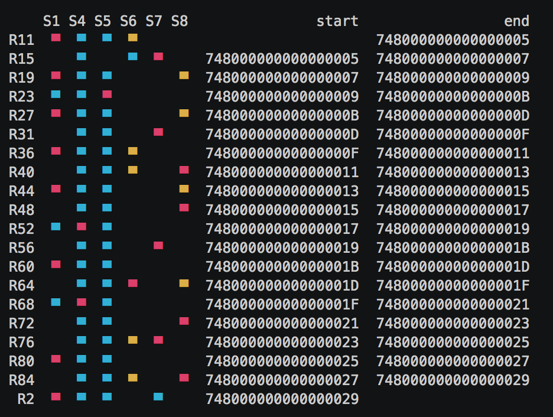

# region-dist-cli

Visualize region distribution of a [TiDB](https://github.com/pingcap/tidb) Cluster.



## Usage:
1. compile:
```bash
go get github.com/disksing/region-dist-cli
```

2. show region distribute 
```bash
region-dist-cli region print 

```

3. export hot region info
```bash
./region-dist-cli hot write/read
```
